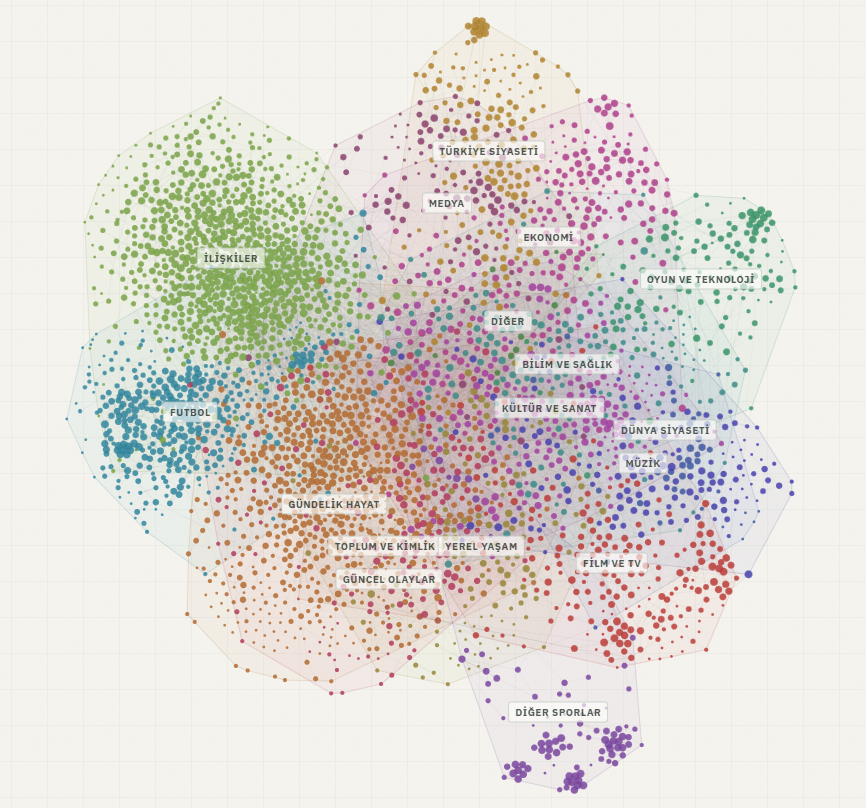

# gök

Gök is a discovery platform for Ekşi Sözlük that turns real-time data into two unique ways to see what people are discussing:

- [**Radar**](https://humanova.space/gok): a live view of topics gaining activity with AI summaries, timeline activity replay, and rank movement.

- [**Atlas**](https://humanova.space/gok/long-term-map): Browsable maps of durable topics, built from shared writer participation.

<div align="center">

</div>

- Atlas snapshots are available on [Hugging Face](https://hf.co/datasets/emir/gok-eksi-atlas).

- Entry embeddings and the AI-generated daily digest are optional supporting features, not the project's main path.

## What It Does

### Scraping

The scraper periodically collects trending topics and their new entries from [eksisozluk.com](https://eksisozluk.com). It paginates from the last stored entry, deduplicates data in PostgreSQL, and retains enough history to power both live and long-term discovery.

### Radar

The API serves the Radar UI at `/`. It ranks topics by recent entry activity, shows rank changes, and animates new entries as they arrive. Users can revisit any point in the last 24 hours and replay the following activity at `1x`, or `60x`.
AI-generated briefs give readers a concise explanation of a selected topic when Gemini is configured.


### Topic Map

Atlas is an offline snapshot of durable, recently active topics. It connects topics when enough of the same writers participate in both, forms communities from those links, assigns browseable regions, computes coordinates, validates the layout, and publishes the result atomically.

The map is behavior-led: a link represents shared participation, not semantic similarity or a claim that the two topics are alike. See [Map curation](docs/map-curation.md) for the selection and grouping rules.

## Setup

Prerequisites: Go, PostgreSQL, and a populated [configuration file](configs/templates/config_template.json).

```bash
# Copy and fill in config
cp configs/templates/config_template.json configs/config.json

# Create the database and user (adjust credentials to match your config)
psql -U postgres -c "CREATE USER gok WITH PASSWORD 'gok';"
psql -U postgres -c "CREATE DATABASE gok OWNER gok;"

# Build the scraper, Radar API, and background AI worker
go build -o gok ./cmd/gok
go build -o api ./cmd/api
go build -o digen ./cmd/digen
```

## Run

Start the scraper and background worker. The worker generates Radar topic briefs when a `GeminiApiKey` is configured.

```bash
./run.sh
```

In another terminal, start Radar and open `http://localhost:port`:

```bash
./api
```

Build and publish a fresh map snapshot, then restart the API so it loads the new snapshot:

```bash
./scripts/build-map-pipeline.sh --map-name current
```

The map pipeline needs Gemini to label its browseable regions. It writes timestamped artifacts under `reports/maps/current/`; the API loads that location at startup. Use `--skip-durability --edge-days 30` to include every topic active in the last month, or choose another published map with `--map-name NAME`.

## Optional AI Features

Semantic search and the Turkish daily digest use entry embeddings and Gemini. They are useful additions to the collected corpus, but Radar and Atlas do not require embeddings.

To enable them, configure `EmbedderUrl`, install the Python dependencies, and run the embedder sidecar:

```bash
pip install -r embedder/requirements.txt
python embedder/main.py
```

The `digen` worker creates both topic briefs and the periodic digest. Generate either once with:

```bash
./digen --once
```

