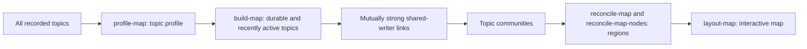

# How the Topic Map Is Curated

18.08.2026

The topic map is a periodically rebuilt snapshot of durable, active discussion on Ekşi Sözlük. It is not a chart of every topic in the database or a list of what is trending at one moment. Its purpose is to show subjects that have an ongoing audience and the subjects whose participants overlap.

The result is published as a versioned snapshot at `reports/maps/current` and displayed at `/map`. The long-term map is displayed at `/long-term-map`.

## In brief



## Pipeline and binaries

The pipeline runs through `scripts/build-map-pipeline.sh`. The script builds the following Go programs as temporary binaries, runs them in order, and publishes their output atomically when every stage succeeds.

| Binary | Role | Main output |
| --- | --- | --- |
| `profile-map` | Scans the full history in the database and calculates topic and writer profiles. | `profile/topics.csv` |
| `build-map` | Selects durable, recently active topics; constructs the shared-writer graph; and detects communities. | `graph/nodes.csv`, `graph/edges.csv`, `graph/clusters.csv` |
| `reconcile-map` | Uses Gemini to assign reader-facing regions to communities. | `community-regions/semantic-regions.json` |
| `reconcile-map-nodes` | Audits each topic's region with its community as context. | `node-regions/node-regions.json` |
| `layout-map` | Computes topic coordinates and writes layout measurements. | `layout/layout.csv`, `layout/summary.json` |

For example, build the current map with:

```bash
./scripts/build-map-pipeline.sh --map-name current
```

The snapshots published on 15 August 2026 contain:

```text
Current Map, activity from 13 February 2025
1,277 durable, active topics
1,853 retained links
  407 communities
   16 reader-facing regions

Long-Term Map, activity from 15 August 2021
3,584 durable, active topics
5,758 retained links
1,006 communities
   17 reader-facing regions
```

## 1. Start with durable topics: `profile-map` and `build-map`

`profile-map` derives one profile per topic from the full entry history in the database. `build-map` uses that profile to select map candidates. A topic must meet all of the following requirements before it can become a candidate:

- At least **30 distinct writers**.
- At least **3 returning writers**: writers who contributed in at least two different months.
- Activity in at least **6 different months**.
- No single week accounts for more than **50%** of all entries.

There is one exception to the last rule. A topic with at least **15 active months** and **12 returning writers** may remain eligible even when one week was unusually busy.

Finally, a topic must have received an entry during the activity window chosen for that map build. The current snapshot starts on 13 February 2025; the long-term snapshot starts on 15 August 2021. This keeps each view active without requiring every topic to be popular today.

## 2. Connect topics through shared participation: `build-map`

`build-map` creates a possible link between two topics when the same writer participates in both. If the same writer participates in two eligible topics, that is evidence that the subjects belong near one another.

The map retains a possible link only when at least **3 writers** participated in both topics. Writers who were active in more than **60 eligible topics** are ignored for this purpose, since their broad activity would otherwise connect unrelated areas.

Each topic then keeps only its **8** strongest links. A link appears on the map only when both topics choose each other among those strongest links. This mutual choice removes many weak, one-sided associations.

For the current-map snapshot:

```text
63,631 writers participated in eligible topics
45,434 writers contributed usable links
 1,272 broad-activity writers were excluded

5,106,756 possible topic pairs
  328,677 pairs shared at least 3 writers
    1,853 mutually strong links appear on the map
```

## 3. Form communities: `build-map`

`build-map` derives groups of closely connected topics from the retained links. These are the current map's **407 communities**. A community can represent a recognizable discussion area, such as relationship questions, a football club and its players, a political group, or a set of games and consoles.

Communities are created from participation patterns first. Their names and display regions are added afterward, so a label does not decide whether topics are connected.

## 4. Label communities and topics with AI: `reconcile-map` and `reconcile-map-nodes`

AI is used for consistent reader-facing labels, not to create the connections. The Gemini model is read from the `GeminiModel` configuration setting; these snapshots use `gemini-3.5-flash-lite`.

### Community labels

`reconcile-map` sends Gemini up to **8 representative topic titles** from each community and assigns the community to one of a fixed set of broad regions. Each request processes **18 communities** and requires exactly one permitted label for each community.

The allowed regions are:

`football`, `other_sports`, `turkish_politics`, `world_politics`, `relationships`, `daily_life`, `music`, `film_tv`, `games_tech`, `economy`, `culture_art`, `society_identity`, `science_health`, `local_life`, `media`, `news_events`, and `other`.

### Individual-topic audit

`reconcile-map-nodes` checks each of the current map's **1,277** topics individually in batches of **18**. The model sees the topic title, its community's initial region, and a small sample of representative titles from that community. It can keep the community label or correct an obvious mismatch.

For example, a city that happens to be linked to football discussion can be moved to `local_life`; a football player remains in `football`.

## 5. Place and display the map: `layout-map` and the API

`layout-map` uses a [force-directed graph drawing](https://en.wikipedia.org/wiki/Force-directed_graph_drawing) to place linked topics near one another. The current snapshot uses **350** layout iterations.

On the map:

- A circle is a topic. Selecting it shows the strongest neighbours.
- A line is a mutually strong shared-writer relationship.
- Topics with **6 or more** retained links are ringed to make highly connected topics easier to spot.
- Region names are browsing aids, not an additional filter on which topics qualify.

## Reading the map responsibly

The map represents overlap in participation among durable, recently active topics. It does not claim that two topics are factually similar, politically aligned, or equally important. A line means that enough of the same writers engaged with both discussions for the relationship to survive the selection rules.

Snapshot summaries and intermediate outputs are retained under `reports/maps/<timestamp>/`, including the profile, graph, AI labelling reports, and layout measurements.