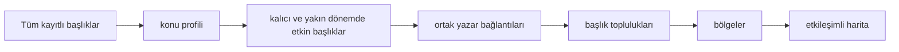

# Gök Atlas Nasıl Oluşturulur?
18.08.2026

Atlas, yani gök başlık haritası, Ekşi Sözlük'te uzun süredir yaşayan ve yakın dönemde de etkin kalan başlıkların düzenli aralıklarla üretilen anlık görüntüsüdür. Veritabanındaki her başlığı veya o anın en popüler başlıklarını göstermeyi amaçlamaz. Amaç, kalıcı bir yazar kitlesi bulunan başlıkları ve ortak yazarları olan konu kümelerini görünür kılmaktır.

Harita çıktısı, sürümlenmiş bir snapshot olarak `reports/maps/current` altında yayımlanır ve `/map` adresinde gösterilir. Uzun dönem haritası ise `/long-term-map` adresindedir.

## Kısaca



## Pipeline ve kullanılan binary'ler

Pipeline, `scripts/build-map-pipeline.sh` scriptiyle çalıştırılır. Script, aşağıdaki Go programlarını geçici bir klasörde (/tmp) derler, sırayla çalıştırır ve tüm adımlar başarılı olduğunda çıktıyı yayımlar.

| Binary | Görevi | Temel çıktı |
| --- | --- | --- |
| `profile-map` | Veritabanındaki tüm geçmişi tarar, başlık ve yazar profillerini hesaplar. | `profile/topics.csv` |
| `build-map` | Kalıcı ve yakın dönemde etkin başlıkları seçer, ortak yazar [grafını](https://tr.wikipedia.org/wiki/%C3%87izge_teorisi) kurar ve [toplulukları](https://en.wikipedia.org/wiki/Community_structure) tespit eder. | `graph/nodes.csv`, `graph/edges.csv`, `graph/clusters.csv` |
| `reconcile-map` | Topluluklara Gemini ile gezinme bölgesi atar. | `community-regions/semantic-regions.json` |
| `reconcile-map-nodes` | Her başlığın bölgesini topluluk bağlamında Gemini ile denetler. | `node-regions/node-regions.json` |
| `layout-map` | Başlık koordinatlarını hesaplar ve yerleşimin ölçümlerini yazar. | `layout/layout.csv`, `layout/summary.json` |

Güncel haritayı üretmek için:

```bash
./scripts/build-map-pipeline.sh --map-name current
```

15 Ağustos 2026 snapshotlarındaki rakamlar:

```text
Güncel Harita, etkinlik başlangıcı 13 Şubat 2025
1.277 kalıcı ve canlı başlık
1.853 bağlantı
  407 topluluk
   16 bölge

Uzun Dönem Haritası, etkinlik başlangıcı 15 Ağustos 2021
3.584 kalıcı ve canlı başlık
5.758 bağlantı
1.006 topluluk
   17 bölge
```

## 1. Kalıcı başlıkları seçmek: `profile-map` ve `build-map`

`profile-map`, veritabanında biriken entry'leri tarayarak her başlık için bir profil çıkarır. `build-map`, bu profili kullanarak harita adaylarını seçer. Bir başlığın aday olabilmesi için aşağıdaki koşulların tamamını karşılaması gerekir:

- En az **30 farklı yazarı** olmalı.
- En az **3 geri dönen yazarı** olmalı. Geri dönen yazar, en az iki ayrı ayda katkı yapmış yazardır.
- En az **6 ayrı ayda** etkinlik göstermeli.
- Tek bir hafta, başlıktaki tüm entry'lerin **%50'sinden** fazlasını oluşturmamalı.

Son koşulun bir istisnası var. Bir başlık en az **15 etkin aya** ve **12 geri dönen yazara** sahipse, olağan dışı yoğun geçen tek bir haftaya rağmen uygun kabul edilebilir.

Son olarak, başlıkta harita oluşturulurken seçilen etkinlik aralığında en az bir entry girilmiş olmalıdır. Güncel haritanın aralığı 13 Şubat 2025'te, uzun dönem haritasının aralığı ise 15 Ağustos 2021'de başlar. Böylece bir başlığın bugün popüler olması gerekmiyor, ama harita yine de güncel kalıyor.

## 2. Başlıkları ortak yazarlarla bağlamak: `build-map`

`build-map`, aynı yazar iki başlığa da yazdığında bu başlıklar arasında olası bir bağ kurar. Aynı yazarın iki uygun başlıkta yazması, bu başlıklar arasında bir ilişki olabileceğine işaret eder.

Bir bağlantının korunması için iki başlıkta da en az **3 ortak yazarın** yazmış olması gerekir. **60'tan fazla uygun başlıkta** etkin olan yazarlar bu hesapta dikkate alınmaz. Böylece çok geniş ilgi alanı olan yazarların ilgisiz bölgeleri birbirine bağlaması engellenir.

Her başlık daha sonra yalnızca en güçlü **8 bağlantısını** korur. Bir çizginin haritada görünmesi için iki başlığın da birbirini bu en güçlü bağlantıları arasında seçmiş olması gerekir. Bu karşılıklı seçim, zayıf ve tek taraflı ilişkilerin büyük bölümünü eler.

Güncel haritanın 1,5 yıllık snapshot'ında:

```text
63.631 yazar uygun başlıklara katıldı
45.434 yazar kullanılabilir bağlantı üretti
 1.272 geniş etkinlikli yazar hesabın dışında bırakıldı

5.106.756 olası başlık çifti tespit edildi
  328.677 çiftin en az 3 ortak yazarı vardı
    1.853 karşılıklı bağlantı haritada yer aldı
```

## 3. Toplulukları oluşturmak: `build-map`

`build-map`, karşılıklı bağlantılardan birbirleriyle güçlü biçimde ilişkili başlık gruplarını, yani toplulukları tespit eder. Güncel haritada 1.853 bağlantı **407 topluluk** oluşturdu. Bir topluluk ilişki konularındaki başlıkları, bir futbol kulübüyle ilgili başlıkları veya siyasi başlıkları bir araya getirebilir.

Topluluk etiketleri önce yazar katılımı örüntüleriyle belirlenir. İsimleri ve ekranda görünen bölgeleri daha sonra eklenir. Hangi başlıkların birbirine bağlanacağını belirlemez.

## 4. Toplulukları ve başlıkları LLM ile etiketlemek: `reconcile-map` ve `reconcile-map-nodes`

LLM, bağlantıları kurmak için değil, okuyucunun kolayca gezinebileceği tutarlı etiketler üretmek için kullanılır. Kullanılan Gemini modeli configden(`GeminiModel`) alınır. Bu snapshot'larda `gemini-3.5-flash-lite` kullanılmıştır.

### Topluluk etiketleri

`reconcile-map`, her topluluktan en fazla **8 temsilci başlık** alır ve topluluğu önceden tanımlanmış 17 geniş bölgeden birine (siyaset, futbol vb.) atar. Her batch'te **18 topluluk** etiketlenir. Modelden her topluluk için yalnızca izin verilen etiketlerden birini seçmesi istenir. 

İzin verilen bölgeler şunlardır:

`football`, `other_sports`, `turkish_politics`, `world_politics`, `relationships`, `daily_life`, `music`, `film_tv`, `games_tech`, `economy`, `culture_art`, `society_identity`, `science_health`, `local_life`, `media`, `news_events` ve `other`.


### LLM ile topluluk etiketi kontrolü

`reconcile-map-nodes`, güncel haritadaki **1.277** başlığın her birini **18 başlık** içeren batch'lerde denetler. LLM'e başlığın adı, ait olduğu topluluğun bölgesi ve o topluluktan birkaç temsilci başlık verilir. Model, topluluğun bölgesini olduğu gibi bırakabilir veya açık bir uyumsuzluk varsa düzeltebilir.

Örneğin futbol tartışmalarıyla bağlantılanmış bir şehir başlığı `local_life` bölgesine taşınabilir. Futbolcu başlığı ise `football` altında kalır.

## 5. Haritayı yerleştirmek ve göstermek: `layout-map` ve API

`layout-map`, bağlantılı başlıkları birbirine yakın konumlandıran [kuvvet tabanlı bir graf yerleşimi](https://en.wikipedia.org/wiki/Force-directed_graph_drawing) hesaplar. Güncel snapshot'ta **350 layout iterasyonu** kullanılmıştır.

Haritada:

- Her daire bir başlığı temsil eder. Başlık seçildiğinde en güçlü komşuları gösterilir.
- Her çizgi, karşılıklı güçlü bir ortak yazar ilişkisini temsil eder.
- **6 veya daha fazla** korunan bağlantısı olan başlıklar, daha kolay fark edilmeleri için halka ile vurgulanır.
- Bölge adları gezinmeyi kolaylaştırır; bir başlığın seçime uygun olup olmadığını belirleyen ek bir süzgeç değildir.

## Haritayı doğru yorumlamak

Harita, etkin başlıklardaki yazarların ne ölçüde kesiştiğini gösterir. Bu bağlantı, iki başlığın anlamsal olarak benzer, siyasi olarak aynı çizgide veya eşit derecede önemli olduğu anlamına gelmez. Bağlantılar, iki başlıkta yeterince çok ortak yazar bulunduğunu ve ilişkinin belirlenen seçim koşullarını karşıladığını gösterir.

Her snapshot özeti ve diğer çıktılar `reports/maps/<timestamp>/` altında saklanır. Başlık profilleri, graf, AI etiketleri ve başlıkların haritadaki yerleşim bilgileri buraya yazılır.